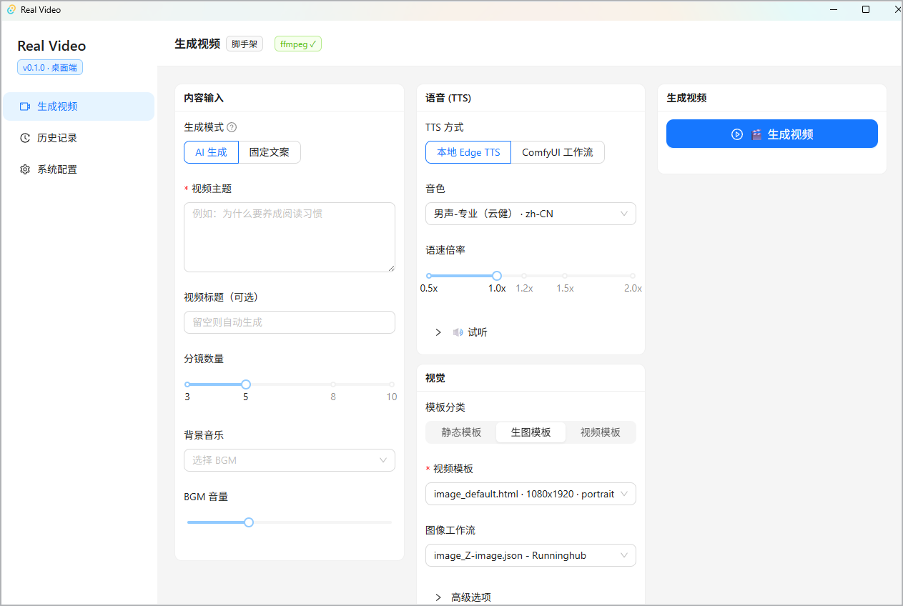

<h1 align="center">🎬 Reel-Video</h1>

Type a topic, and AI produces a finished short video

<b>English</b> | <a href="README.md">中文</a>

  
  
  

  

## About

Reel-Video is a cross-platform desktop app that turns short-video creation into a single sentence.

Just type a **topic** — it handles the entire pipeline automatically:

> Write the script → generate AI images / video → synthesize voiceover → add background music → render the final video

- 🖥️ **Native desktop** — Windows / macOS, download and run, no Python, command line, or browser needed
- 📦 **Engine included** — the full backend is bundled in the installer and runs locally and offline, with no external server
- 🎬 **Zero editing skill** — fully automated from topic to finished video, no video-editing experience required
- 🧩 **Swappable building blocks** — built on ComfyUI workflows; the script model, image model, voice, and templates are all replaceable

## Download

Grab the latest build from [**Releases**](https://github.com/Grivt/Reel-Video/releases):

| Platform | Installer |
| --- | --- |
| Windows | `Real Video_x.x.x_x64-setup.exe` |
| macOS (Intel) | `Real Video_x.x.x_x64.dmg` |

> On first launch the app checks for dependencies such as ffmpeg and, if any are missing, shows platform-specific install guidance.

## Usage

1. Open the app, go to **⚙️ Settings**, and fill in the API for an LLM (Qwen / GPT / DeepSeek, etc.) and an image service (local ComfyUI or cloud RunningHub).
2. Back on **Generate Video**, type a topic, e.g. "Why you should build a reading habit".
3. Pick a voice, video template, and other options, then click **Generate Video**.
4. When the progress finishes, preview the result under **History**, or open it in your file manager.

## License

Released under the [Apache License 2.0](LICENSE). This project is derived from an upstream open-source project; upstream and third-party attributions are listed in [NOTICE](NOTICE).
